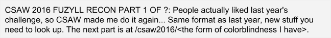
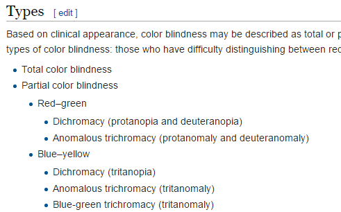
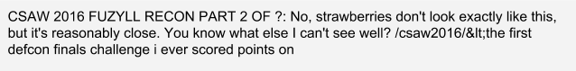
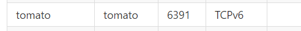
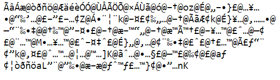
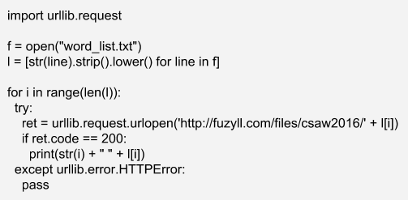
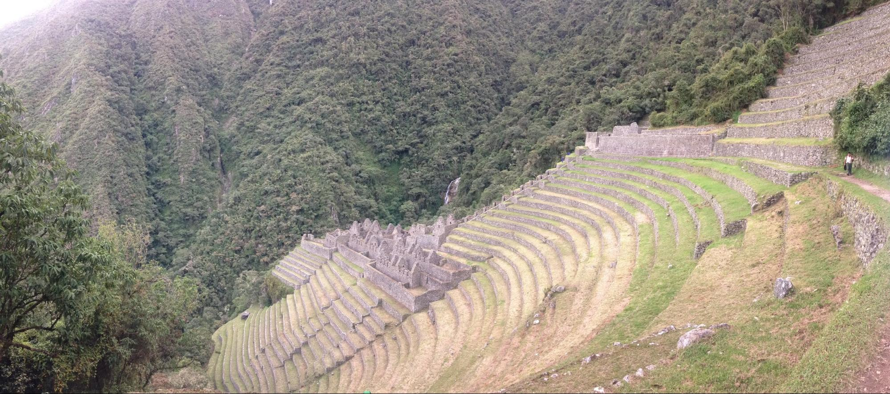
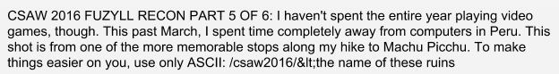
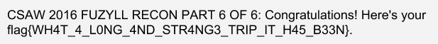

# Fuzyll 

## Information

*CTF*: CSAW Quals 2016

*Category*: Misc

*Point Value*: 200

*Writeup Author*: github.com/nalshihabi

## Writeup
 
So for the beginning of this challenge, you are given the url: [http://fuzyll.com/files/csaw2016/start](https://www.google.com/url?q=http://fuzyll.com/files/csaw2016/start&sa=D&ust=1543614497360000)

And you get the following message:



So what kind of colorblindness does Fuzyll have? Idk. But Wikipedia knows all the different kinds.



Yeah, not many types. The kind Fuzyll has is deuteranomaly so just replace the “start” in the original url with deuteranomaly and go to that.

There, you get this image:


You download this picture but what you download is a text file named “deuteranomaly.txt” and near the beginning is the string:



To solve this part of the challenge, I first googled “Fuzyll DEFCON finals challenges.” I find a github page: [https://github.com/fuzyll/defcon-vm](https://www.google.com/url?q=https://github.com/fuzyll/defcon-vm&sa=D&ust=1543614497361000) 

Looking through the page there are a lot of challenges listed. But remembering what his clue said, the first problem he got at defcon finals is something he can’t see very well. Deuteranomaly is a type of red-green color blindness. Are there any specific names of a challenge on there that is an object that is red and green, like a strawberry?



Pretty sure tomatoes are red and green. So I tried that and what do you know it works!

We get to [http://fuzyll.com/files/csaw2016/tomato](https://www.google.com/url?q=http://fuzyll.com/files/csaw2016/tomato&sa=D&ust=1543614497362000) 

And then…



I didn’t know what to do here. So… I decided to do something that probably nobody else did. I guessed the next page. I wrote a small python script to brute force a word list for the next filename on the website. I figured that since “tomato” is a common English word, maybe the next filename is or even better yet, the flag file page is named by a common English word. Either way, it shouldn’t take long to test the theory out and since I don’t know what else to do, screw it. Here is the python script I wrote:



The word list I used (one of them in this repo):

[https://github.com/first20hours/google-10000-english](https://www.google.com/url?q=https://github.com/first20hours/google-10000-english&sa=D&ust=1543614497362000) 

I find viable options:

```
*   start
*   tomato
*   jade
```

Hm… What is at /jade? This picture is:



Convert the image to a text file and you find the following message:



Reverse google image search the picture and you find out the name of these ruins is “Wiñay Wayna” and the only ASCII version is “Winay Wayna.”

So at /winaywayna you find the following message:

